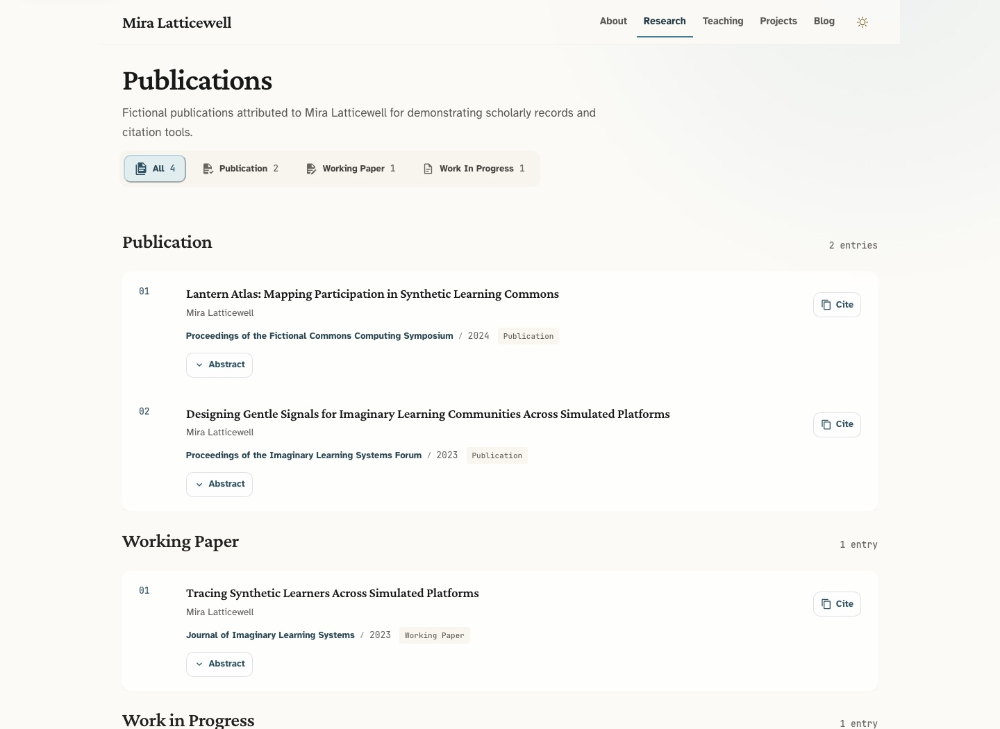

[English](./README.md) · [简体中文](./README.zh-CN.md)

# Scholar Pages

Scholar Pages 是一个 Astro 学术主页模板，包含个人简介、论文、项目、教学和博客页面。
资料分别保存在 TypeScript、BibTeX、YAML 和 Markdown 文件中，日常更新内容无需修改页面组件。


## 模板包含什么

- 论文筛选、摘要展开，以及 BibTeX、APA 7、Chicago 和 Harvard 引用复制。
- 精选文章、可选封面和自动计算的阅读时长。
- 在 `site.config.ts` 中选择要显示的首页区块。
- 适配桌面和手机的浅色、深色模式，支持键盘焦点和原生无障碍控件。
- 内置 canonical URL、Open Graph、JSON-LD、站点地图、`robots.txt` 和模板更新 PR。

<details>
<summary>查看博客和论文页预览</summary>




</details>

## 快速开始

先安装 [Node.js](https://nodejs.org/) 22.13+ 和 [pnpm](https://pnpm.io/) 11+。

### 1. 创建站点

点击 [**Use this template**](https://github.com/jxpeng98/astro-theme-scholars/generate)
创建自己的仓库，然后克隆到本地。将下面的 `your-handle` 换成 GitHub 用户名，
两处 `your-site` 都换成你的仓库名：

```bash
git clone https://github.com/your-handle/your-site.git
cd your-site
pnpm install
pnpm dev
```

打开 [http://localhost:4321](http://localhost:4321) 预览网站。

<details>
<summary>也可以从命令行创建</summary>

```bash
pnpm create astro@latest my-scholar-site --template jxpeng98/astro-theme-scholars
cd my-scholar-site
pnpm install
pnpm dev
```

</details>

### 2. 换成自己的内容

先修改 [site.config.ts](./site.config.ts) 中的 `author`、`siteUrl` 和 `hero`。
用自己的头像替换 `public/profile.svg`，或在 `hero.profileImage` 中填写图片路径。
再按[内容改哪里](#内容改哪里)替换资料和封面。Mira Latticewell、相关院校及所有示例内容
都是虚构的，发布前请删除或替换。

### 3. 部署网站

把 `siteUrl` 改成正式网址，然后运行：

```bash
pnpm verify
```

命令会运行测试、类型和内容检查，并将网站构建到 `dist/`。把这个目录部署到
Cloudflare Pages、Vercel、Netlify、GitHub Pages 或其他静态托管平台即可。
如果由平台构建，构建命令填 `pnpm build`，输出目录填 `dist`。

**建站和部署不需要开启 Actions 的 PR 权限。** 使用默认的[自动更新功能](#模板更新)时才需要开启。

## 内容改哪里

| 内容 | 文件或目录 |
| --- | --- |
| 姓名、单位、链接、SEO 和页面简介 | `site.config.ts` |
| 论文与工作论文 | `src/data/publications.bib` |
| 简介、工作经历、教育、学术服务和奖项 | `src/data/about.yml` |
| 项目 | `src/content/projects/`，每个项目一个 `.md` 文件 |
| 教学 | `src/content/teaching/`，每门课程一个 `.md` 文件 |
| 博客与研究随笔 | `src/content/posts/`，使用 `.md` 或 `.mdx` |
| 头像、favicon 和其他静态文件 | `public/` |
| 项目、教学和文章封面 | `src/assets/` |
| 颜色、字体、图标和共用样式 | `uno.config.ts` |

### 站点配置

直接修改现有的 [site.config.ts](./site.config.ts)：`affiliations` 填写任职信息，
`researchInterests` 填写研究兴趣，`socialLinks` 填写个人主页链接。`homeBlocks` 控制
个人介绍、项目、论文和文章区块的显示与标题。没有填写的导航、页面标题、页脚文案、
图片尺寸和区块标题由 `defineSiteConfig` 提供默认值。

canonical URL、Open Graph URL、`robots.txt` 和站点地图都使用 `siteUrl`。

## 内容管理

### 论文

在 [src/data/publications.bib](./src/data/publications.bib) 中添加 BibTeX 条目。
额外的 `public` 字段决定论文页中的分组：

| `public` 值 | 分组 |
| --- | --- |
| `yes` | Publication（已发表），可入选首页精选论文 |
| `wp` | Working Paper（工作论文） |
| `wip` | Work in Progress（进行中） |
| 其他值或未填写 | Other（其他） |

填写 `abstract` 可展开摘要，填写 `url` 可为标题和 PDF 按钮添加链接。Cite 提供
BibTeX、APA 7、Chicago 和 Harvard 格式。BibTeX 导出保留大小写保护花括号、DOI、卷期、
页码和自定义字段，条目之间支持注释。机构作者需要额外一层花括号，例如
`author = {{Research and Policy Group} and de la Cruz, Juan}`；`@string` 宏要先定义再引用。
正式提交前，请核对特殊文献类型和 LaTeX 命令的格式化引用结果。

### 关于

修改 [src/data/about.yml](./src/data/about.yml)。页面按文件中的顺序显示；删除顶层列表
或设为 `[]` 可以隐藏区块，空的可选记录会被忽略。自定义区块可放奖项、演讲等内容，
其中第一个会在宽屏上与学术服务并排显示。页面标题和简介在 `site.config.ts` 中修改。

### 项目、教学和文章

复制 `src/content/` 中的现有条目，修改 YAML frontmatter 和 Markdown 正文；文章也支持
MDX。字段示例、封面、链接和旧版项目、教学 YAML 的迁移方法，见[内容编写指南](./docs/content-authoring.md)。

- 文件名决定详情页地址，也支持子目录：`posts/2026/note.mdx` 对应 `/posts/2026/note`，
  原有单层 URL 保持不变。
- 项目和课程的外部资源写在 `links` 中，构建时会检查字段。
- `draft: true` 隐藏条目。博客优先展示最新一篇 `featured: true` 的已发布文章；
  没有精选文章时，展示最新发布的一篇。
- 文章封面使用 `heroImage`，并且必须填写 `heroImageAlt`；项目和课程使用 `cover`
  与 `coverAlt`。不需要封面时，删除图片字段即可。
- 封面会生成响应式 WebP 图片，无封面的卡片使用完整宽度。文章阅读时长自动计算。

## 内置页面

| 路径 | 内容 |
| --- | --- |
| `/` | 个人资料、精选项目、精选论文和近期文章 |
| `/about` | 简介、经历、教育、学术服务与自定义区块 |
| `/researches` | 按研究状态分组、支持筛选的论文列表 |
| `/teaching` | 按学期整理的当前与过往教学记录 |
| `/teaching/[...slug]` | 课程详情与外部资源 |
| `/projects` | 当前和过往项目、元数据与链接 |
| `/projects/[...slug]` | 项目详情与外部资源 |
| `/posts` | 精选文章与博客归档 |
| `/posts/[...slug]` | 文章正文、阅读信息和分享链接 |

页面代码在 `src/pages/`，共用组件在 `src/components/`，布局在 `src/layouts/`。
配置默认值在 `src/config/`，内容与 SEO 工具在 `src/lib/`，预览图在 `docs/screenshots/`。
Astro 设置在 `astro.config.ts`，依赖和命令在 `package.json`。

## 常用命令

| 命令 | 用途 |
| --- | --- |
| `pnpm dev` | 启动开发服务器 |
| `pnpm build` | 构建到 `dist/` |
| `pnpm preview` | 预览生产构建 |
| `pnpm test` | 运行单元测试 |
| `pnpm astro check` | 检查 Astro 与 TypeScript |
| `pnpm test:content` | 检查嵌套路由、MDX、草稿、无封面和空内容 |
| `pnpm test:browser` | 在 Chromium、Firefox 和 WebKit 中检查交互 |
| `pnpm verify` | 运行测试、类型检查、构建、生成结果断言和内容回归 |

<details>
<summary>运行浏览器测试</summary>

先执行 `pnpm exec playwright install chromium firefox webkit` 安装引擎（Linux 加
`--with-deps`），再运行 `pnpm test:browser`。用 `pnpm exec playwright show-report`
查看结果，失败时包含截图和操作轨迹。测试使用临时内容和本地预览，不修改个人内容或
当前 `dist/`。CI 会运行 `pnpm verify` 和三种浏览器检查。WebKit 检查不能代替真实
Apple 设备上的 Safari 测试。

macOS 27 上 Firefox 可能因[上游应用数据权限问题](https://bugzilla.mozilla.org/show_bug.cgi?id=2060476)
无法启动。可用 `pnpm test:browser --project=chromium --project=webkit` 检查其他引擎；
默认命令和 CI 仍要求三种引擎全部通过。

</details>

## 模板更新

更新会以 PR 的形式提交，由你检查并合并。使用默认 GitHub 令牌时，先在自己的仓库中
完成一次设置：

1. 打开 **Settings → Actions → General → Workflow permissions**，勾选
   **Allow GitHub Actions to create and approve pull requests**，点击 **Save**。
2. 打开 **Actions → Template Update → Run workflow**。工作流也会在每周一检查新版本。
3. 检查并合并 `chore/template-update-X.Y.Z` PR。更新器会先安装依赖、运行 `pnpm verify`，
   通过后才创建或更新 PR。

第一步的权限属于**用户自己的仓库**，不会随模板复制；个人账户的新仓库默认关闭。
如果遇到 `GitHub Actions is not permitted to create or approve pull requests`，
开启后重新运行失败的任务即可。详见 [GitHub 权限说明](https://docs.github.com/en/repositories/managing-your-repositorys-settings-and-features/enabling-features-for-your-repository/managing-github-actions-settings-for-a-repository#preventing-github-actions-from-creating-or-approving-pull-requests)。

保留 `.github/workflows/template-update.yml`、`.template-sync.json` 和 `.template-version`。
更新前不要把 `.template-version` 改成目标版本，否则更新器会认为已经安装。

`.template-sync.json` 中 `protected` 列出的路径会保留，默认包括站点配置、YAML 与
BibTeX 数据、内容条目、项目与教学图片、头像、favicon 和环境变量文件。其他模板文件
会被替换，改过代码的站点尤其需要检查 PR。未配置 `TEMPLATE_UPDATE_TOKEN` 时，工作流
文件会跳过，需要手动更新。

旧站点先查看 `.template-version`：`v0.6.x` 需要按下文替换工作流；版本早于 `0.6.0`
或文件不存在时，需要先迁移。

<details>
<summary>旧站点：替换工作流与迁移</summary>

**v0.6.x：** 把 `v0.7.0` 的 `.github/workflows/template-update.yml` 复制到默认分支，
再按上面的步骤更新。旧版更新器无法用默认令牌替换工作流；从 `v0.7.0` 起，更新器会
使用目标版本自带的迁移脚本，后续数据迁移无需再次替换。

`v0.7.0` 的迁移会将 `src/data/projects.yml` 和 `src/data/teaching.yml` 转成 Markdown，
不会混入演示条目或覆盖已有 Markdown。原 YAML 会保留，方便比较或回滚；检查生成的
条目和页面后，再删除旧文件。

**早于 v0.6.0，或没有 `.template-version`：** 即使已有更新工作流，也要先迁移。
确认工作区没有未提交改动，在站点仓库根目录用兼容 Bash 的终端运行以下命令。
脚本会将个人配置迁移到 `site.config.ts`，安装兼容入口和更新器，清理已废弃的模板内容
与 robots 文件，并保留受保护的个人内容。

```bash
git switch -c chore/template-update-v0.9.0

template_dir="$(mktemp -d)"
template_dir="$(cd "$template_dir" && pwd -P)"
git clone --depth 1 --branch v0.9.0 \
  https://github.com/jxpeng98/astro-theme-scholars.git \
  "$template_dir"

node "$template_dir/scripts/sync-template-release.mjs" \
  --source "$template_dir" \
  --target . \
  --config "$template_dir/.template-sync.json"

pnpm install --frozen-lockfile
node scripts/migrate-legacy-content.mjs
pnpm verify
git status --short
git diff
```

检查差异，提交并创建 PR；提交前恢复默认保护范围以外的个人文件。如果脚本提示旧配置
不受支持，请手动迁移该文件，不要强制同步。之后的版本可以使用自动更新。

不要通过 `--allow-unrelated-histories` 合并模板仓库：
[从模板创建的仓库有独立的 Git 历史](https://docs.github.com/en/repositories/creating-and-managing-repositories/creating-a-template-repository#about-template-repositories)。
模板版本使用 SemVer 标签，例如 `v0.9.0`。

</details>

<details>
<summary>可选：自动更新工作流文件</summary>

修改 `.github/workflows/**` 还需要单独的 `Workflows` 权限，仅允许创建 PR 不够。
如需同步这些文件，创建一个设有有效期、仅授权当前站点仓库的细粒度个人访问令牌，授予：

- `Contents: Read and write`
- `Pull requests: Read and write`
- `Workflows: Write`

将其保存为 Actions secret `TEMPLATE_UPDATE_TOKEN`，更新器会自动识别。不要把令牌
写进工作流文件，不用后及时撤销；组织仓库可能需要管理员批准。

早于 `v0.7.0` 的更新器仍需先替换工作流。如果一直手动维护工作流，可以把
`.github/workflows/**` 加入 `.template-sync.json` 的 `protected` 列表。

GitHub 文档：[个人访问令牌](https://docs.github.com/en/authentication/keeping-your-account-and-data-secure/managing-your-personal-access-tokens)、
[Actions secrets](https://docs.github.com/en/actions/how-tos/write-workflows/choose-what-workflows-do/use-secrets)、
[Workflows 权限](https://docs.github.com/en/apps/creating-github-apps/registering-a-github-app/choosing-permissions-for-a-github-app#choosing-permissions-for-git-access)。

</details>

## 参与贡献

欢迎提交 Issue 和 PR。较大的改动，请先开 Issue 讨论预期行为和范围。

<details>
<summary>开发和发布模板（维护者）</summary>

```bash
git clone https://github.com/jxpeng98/astro-theme-scholars.git
cd astro-theme-scholars
pnpm install
pnpm dev
```

发布前统一 `package.json`、`.template-version` 和 `CHANGELOG.md` 最新条目的版本号，
提交已审核的变更。将下面的 `v0.9.0` 替换为本次要发布的版本：

```bash
pnpm verify
pnpm exec playwright install chromium firefox webkit
pnpm test:browser
node scripts/check-release.mjs --tag v0.9.0
git push origin main
```

等待**同一提交**的 **Verify** 工作流通过，包括三种浏览器检查，再创建并推送标签：

```bash
git tag -a v0.9.0 -m "v0.9.0"
git push origin v0.9.0
```

下游更新器直接读取 Git 标签，发布工作流失败也不会隐藏已推送的标签。
发布工作流会再次运行站点与浏览器检查，全部通过后创建 GitHub Release。

</details>

## 开源协议

[MIT](./LICENSE)。
