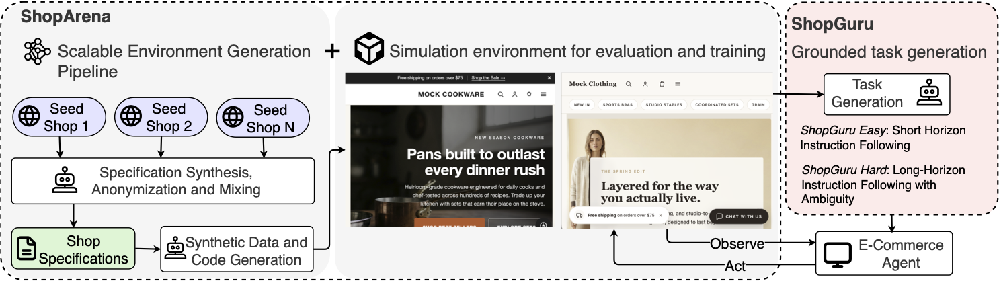

## Overview

ShopGym is an integrated framework for building realistic, reproducible simulation environments and scalable benchmarks for e-commerce web agents. It preserves the structure and interaction patterns of live storefronts while producing self-contained environments that can be reset, inspected, and used safely for reinforcement learning and evaluation.

## Architecture

## System

The framework combines three core components:

- **ShopArena** converts live seed storefronts into deterministic sandbox shops with generated catalogs, navigation, policies, and interaction flows.
- **ShopGuru** synthesizes grounded evaluation tasks across seven shopping-agent skill categories.
- **ShopBackend** serves each sandbox through a local GraphQL API, supporting repeatable agent interaction and evaluation.

## Results

ShopGym was validated through structural analysis and agent-based evaluation using 224 grounded tasks across six sandbox shops. Agent performance in the simulated environments correlated positively with performance on the corresponding live storefronts.

The work was accepted to the **NeurIPS 2026 Evaluations & Datasets Track** and was also selected for the **ICML 2026 RLxF Workshop** and **LSEI @ COLM 2026**.
